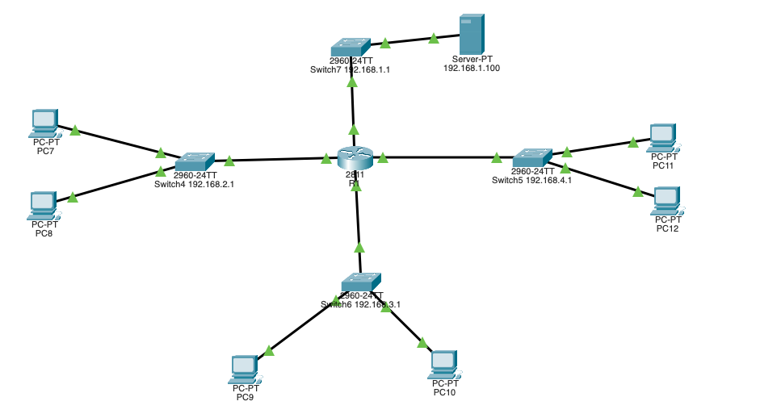

# 🖧 Cisco Packet Tracer - Multi-Network Topology Project

This project demonstrates a **multi-subnet network topology** designed using **Cisco Packet Tracer**. It consists of multiple PCs, switches, a central router, and a server, segmented into four distinct subnets.

---

## 📁 Project Files

- `network-topology.pkt` – Main Cisco Packet Tracer project file *(add this file before uploading)*
- `topology.png` – Network diagram image (screenshot of the topology)
- `README.md` – Project description and documentation

---

## 🧱 Network Design

The topology is structured around **4 subnets**, each connected through a central **Router (2811)**.

### 🔌 Subnets & Devices

| Subnet         | Switch IP       | Connected Devices           |
|----------------|------------------|------------------------------|
| 192.168.1.0/24 | 192.168.1.1      | Server, Switch1             |
| 192.168.2.0/24 | 192.168.2.1      | PC7, PC8, Switch4           |
| 192.168.3.0/24 | 192.168.3.1      | PC9, PC10, Switch6          |
| 192.168.4.0/24 | 192.168.4.1      | PC11, PC12, Switch5         |

---

## 🎯 Objectives

- Practice **IP subnetting** and inter-VLAN routing.
- Configure **static IPs** or use DHCP across different networks.
- Simulate **end-to-end connectivity** across subnets.
- Implement **basic switch configuration and routing** on the router.

---

## ⚙️ Technologies Used

- Cisco Packet Tracer 8.x
- 2960-24TT Switches
- 2811 Router
- PCs and Server

---

## 🛠️ How to Use

1. Download the `.pkt` file and open it with **Cisco Packet Tracer**.
2. Assign IP addresses to each PC if not already assigned.
3. Ensure correct routing setup on the router.
4. Test connectivity using `ping` between PCs in different subnets.
5. Extend with VLANs, DHCP, NAT, or ACLs if desired.

---

## ✅ Future Enhancements

- Add VLAN segmentation and trunk links
- Implement DHCP and NAT on the router
- Add ACLs for network security policies
- Introduce redundancy using additional routers

---

## 👨‍💻 Author

Created by [Pratham Deora]  
📫 Connect on LinkedIn: https://www.linkedin.com/in/pratham-deora/

---

## 📜 License

This project is for educational purposes. Feel free to modify and use it in your learning or labs.

